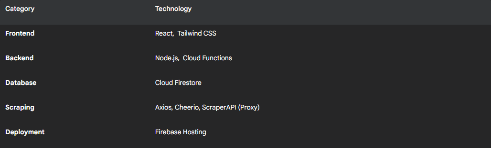
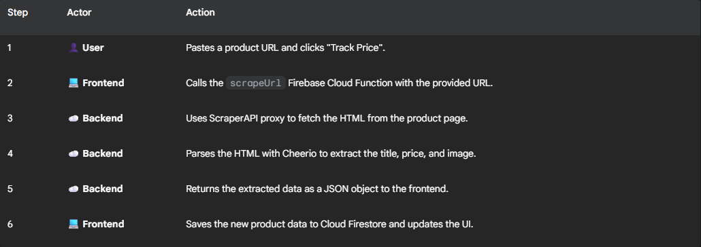

# Price Tracker Application

A full-stack web application that allows users to track product prices from Amazon AU and JB Hi-Fi. Paste a product link, and the app fetches its details, storing them for you to monitor.

<a href="https://ficcc.github.io/tracker/" style="text-decoration: none;">
More about Workflow and Deployment
</a>

  
<a href="https://web-tracker-312f2.web.app/" style="text-decoration: none;">
Live Preview Here
</a>

## ✨ Features

- Real-time Price Scraping: Fetches live product data from Amazon AU.
- Persistent Storage: Uses Cloud Firestore to save and manage your tracked products.
- Dynamic UI: Frontend built with React for a responsive and interactive experience.
- Price Change Indicators: Visual cues (🟢/🔴 arrows) show if a product's price has increased or decreased since the last check.
- Search & Refresh: Easily search through your tracked items and refresh all prices with a single click.

## 🛠️ Technology Stack

## ⚙️ Application Workflow

The application uses a serverless architecture where the frontend client communicates with a backend cloud function to perform the scraping.

